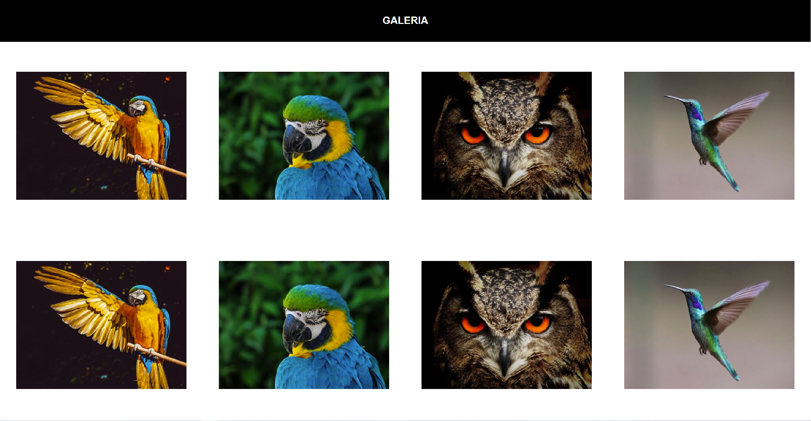

## General info

Resository contains tasks from Front-end intermediate course.
The Motivation to do the project was learn CSS positioning/flexbox concepts.

## Table of contents
* [General info](#general-info)
* [Screenshots](#screenshots)
* [Technologies](#technologies)
* [Content](#content)
* [Status](#status)
* [Inspiration](#inspiration)

## Screenshots

<!-- 

 -->

## Technologies:
 * HTML5
 * CSS3
 * JavaScript (ES6)
 * JQuery 3.5.1.
 * Flexbox
 * Sass

## Content:
 ### positioning in CSS: 
     picture, chessboard (inline-block, float, absolute)
 ### flexbox: 
     simple calculator, modern calculator, flexbox-card
 ### media-queries:
     responsive galery/layout/menu
 ### jQuery: 
     add element/effects, hamburger-menu
 ### JavaScript: 
     add element/effects, drop-down menu, flyout menu 
 ### Sass: 
     responsive menu with Sass (SASS, SCSS)

## Setup
link to netlify

## Status
Project is: _in progress_

## Inspiration
Tasks are inspired by the course "Frontend intermediate" by Samuraj Programowania (Udemy).
